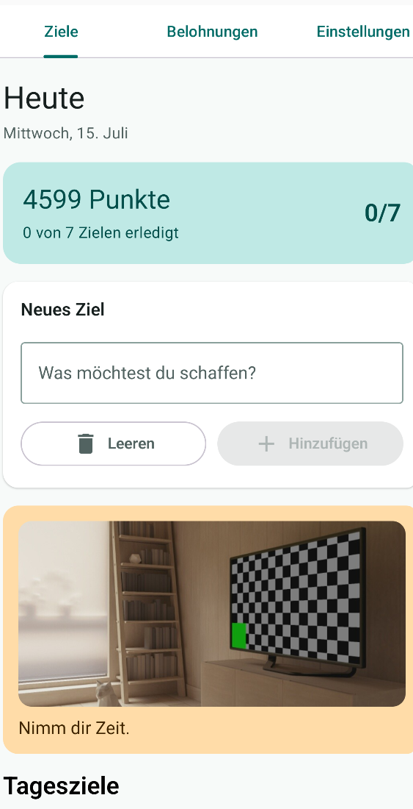
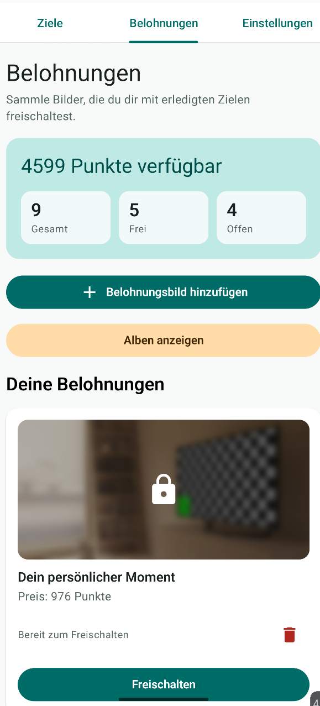
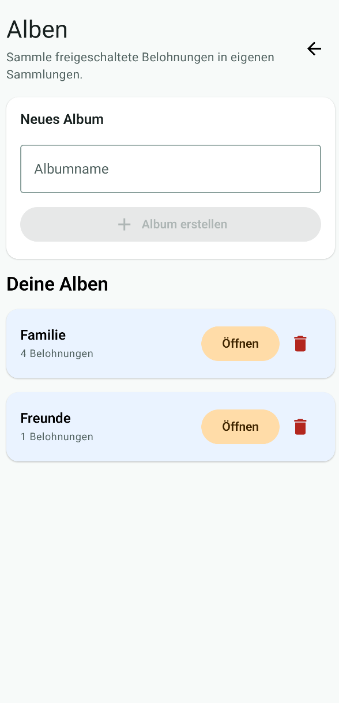
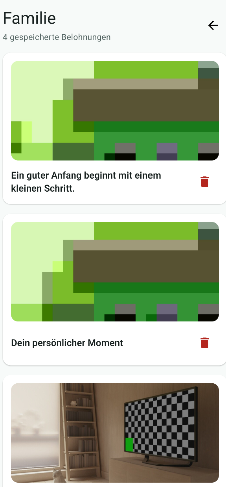
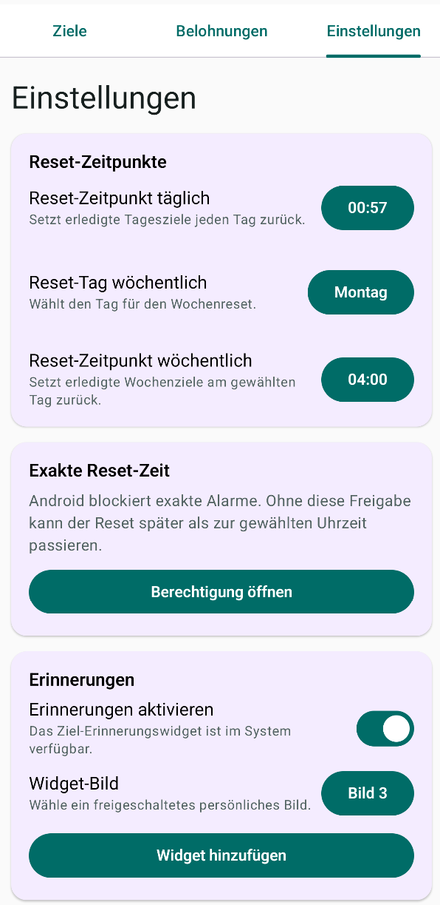
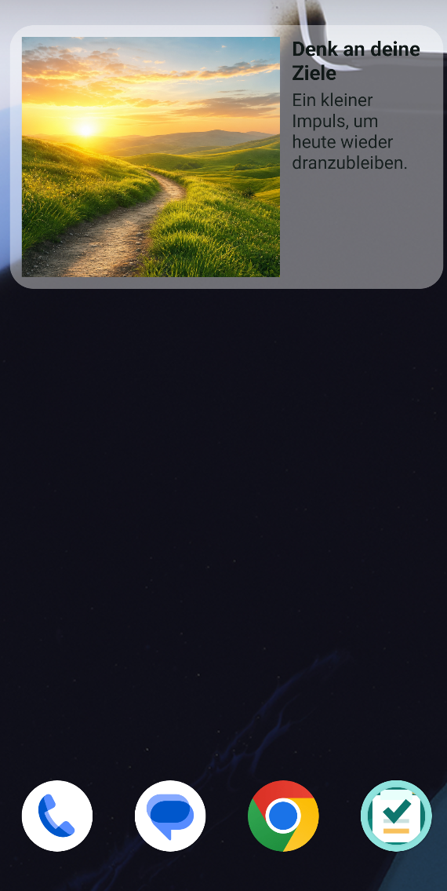

# MyDailyActivity

MyDailyActivity ist eine Android-App für persönliche Ziele, Motivation und Belohnungen. Die App verbindet tägliche und wöchentliche Ziele mit einem Punktesystem, freischaltbaren Bildern, Alben und einem optionalen Homescreen-Widget.

## Screenshots

<table>
  <tr>
    <td align="center"><strong>Tagesziele</strong></td>
    <td align="center"><strong>Belohnungen</strong></td>
    <td align="center"><strong>Alben</strong></td>
  </tr>
  <tr>
    <td></td>
    <td></td>
    <td></td>
  </tr>
  <tr>
    <td align="center"><strong>Sammlung</strong></td>
    <td align="center"><strong>Einstellungen</strong></td>
    <td align="center"><strong>Widget</strong></td>
  </tr>
  <tr>
    <td></td>
    <td></td>
    <td></td>
  </tr>
</table>

## Funktionen

- Tagesziele mit frei wählbaren Punkten
- Wochenziele mit eigenem wöchentlichen Reset
- Punkte sammeln und gegen persönliche Belohnungsbilder einlösen
- Alben für freigeschaltete Belohnungen
- Motivationskarten mit freigeschalteten Bildern und Sprüchen
- Einstellbare Reset-Zeitpunkte für tägliche und wöchentliche Ziele
- Optionales Homescreen-Widget mit auswählbarem freigeschaltetem Bild
- Eigene generierte App-Assets und eigenes App-Icon

## Technik

- Kotlin
- Jetpack Compose
- DataStore Preferences
- WorkManager als Reset-Backup
- AlarmManager für möglichst exakte Reset-Zeitpunkte
- Android App Widgets
- Coil für persönliche Bild-URIs

## Build

Das Projekt kann in Android Studio geöffnet und über die normale `app`-Run-Configuration gebaut werden.

Alternativ per PowerShell:

```powershell
$env:JAVA_HOME='C:\Program Files\Android\Android Studio\jbr'
$env:Path="$env:JAVA_HOME\bin;$env:Path"
.\gradlew.bat testDebugUnitTest --no-daemon
```

## Tests

Lokale Unit-Tests:

```powershell
.\gradlew.bat testDebugUnitTest --no-daemon
```

Android-/Compose-Tests kompilieren:

```powershell
.\gradlew.bat assembleDebugAndroidTest --no-daemon
```

Android-/Compose-Tests ausführen:

```powershell
.\gradlew.bat connectedDebugAndroidTest
```

Für `connectedDebugAndroidTest` muss ein Emulator oder ein echtes Android-Gerät verbunden sein.

## Android-Hinweise

Für exakte Reset-Zeitpunkte muss Android die Berechtigung für exakte Alarme erlauben. Die App zeigt dafür in den Einstellungen eine eigene Karte an.

Das Widget wird standardmäßig nicht automatisch aktiviert. In den Einstellungen kann **Erinnerungen aktivieren** eingeschaltet werden. Danach kann ein Widget hinzugefügt oder ein vorhandenes Widget aktualisiert werden.

## Datenschutz

Die App speichert Ziele, Punkte, Belohnungen und Einstellungen lokal auf dem Gerät. Es gibt keinen Server-Login und keine automatische Cloud-Synchronisierung.

## Assets

Die eingebauten Reward- und Widget-Fallbackbilder wurden eigens für dieses Projekt generiert. Persönliche Belohnungsbilder werden vom Nutzer über den Android-Dateipicker ausgewählt.

## Status

Lernprojekt mit Fokus auf saubere Android-Grundlagen, UI-Polish und praxisnahe App-Funktionalität.
